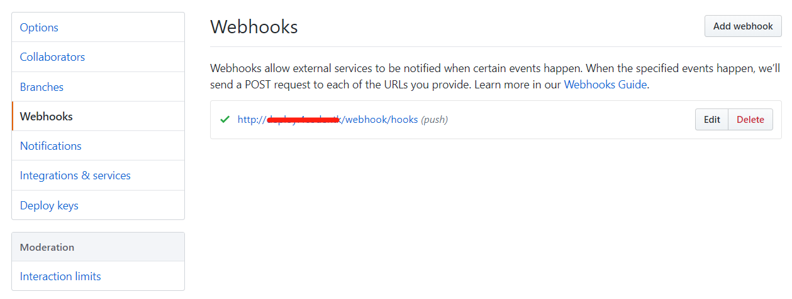

# Github Webhooks 自动化部署

## 准备

此项目不支持 Windows 系统部署，使用前要确保 web 服务器执行用户有拉取项目的权限。

```sh
# 举例项目部署目录为 /data/wwwroot

ls -al /data/wwwroot
total 32
drwxr-xr-x 8 www  www  4096 Jul 18 13:46 .
drwxr-xr-x 5 root root 4096 Jul 15 16:03 ..
drwxr-xr-x 5 www  www  4096 Jul 18 15:24 default
```

如上 `www` 即为 web 服务器的执行用户, 此时需要为 `www` 用户生成密钥对并将公钥添加到 github 要自动部署的项目配置中。


将公钥 `id_ras.pub` 文件中内容复制到 key 项目中。


## 安装

初始化项目：

```sh
# 克隆项目
git clone git@github.com:wewelove/webhook.git
# 进入目录
cd webhook
# 安装依赖
composer install
```

创建虚拟主机（LAMP）指向 `webhook` 目录。

## 配置

根据实际情况配置 `git`、`php`、`composer` 的绝对目录。

```php
# config.php
return [
    'git' => '/usr/bin/git',
    'php' => '/usr/local/php/bin/php',
    'composer' => '/usr/bin/composer',
    'github' => [
        'url' => 'git@github.com:%s.git',
        'ref' => 'refs/heads/'
    ]
];
```

## 项目

根据实际情况可以填写多个项目。 

- `type` 目前只支持 `github`
- `name` 为 `github` 仓库完整名称
- `path` 项目部署目录
- `branch` 部署分支，`master`、`develop`、 `release`
- `secret` 仓库 Webhooks 中配置的密码
- `composer` 事件触发后执行的 `composer` 指令，可省略

```php
# projects.php
return [
    'hooks' => [
        'type' => 'github',
        'name' => 'wewelove/hooks',
        'path' => '/data/wwwroot/hooks',
        'branch' => 'master',
        'secret' => '123456',
        'composer' => 'install --prefer-dist --no-dev'
    ]
    'porject1' => [
        'type' => 'github',
        'name' => 'wewelove/demo',
        'path' => '/data/wwwroot/demo',
        'branch' => 'develop',
        'secret' => '123456',
        'composer' => ''
    ]
];
```

## 启用 Github 项目 Webhooks 设置


1. 进入项目设置页面，点击左侧菜单 `Webhooks`。点击右上的 `Add webhook` 按钮添加新配置项目。

   

2. `Webhooks` 具体配置如下。
   
   `Payload URL` 指向已经配置好的虚拟主机地址，请根据实际情况填写域名或 IP 地址，项目名称与 `projects.php` 文件中配置的项目的键值对应，如 `hooks`、 `project1`。
    
    ```
    http://域名或IP地址/webhook/项目名称
    ```

   `Content type` 请选择 `application/json`。 

   `Secret` 随意填写并与项目配置对应。

   点击 `Add webhook` 按钮添加配置。

   